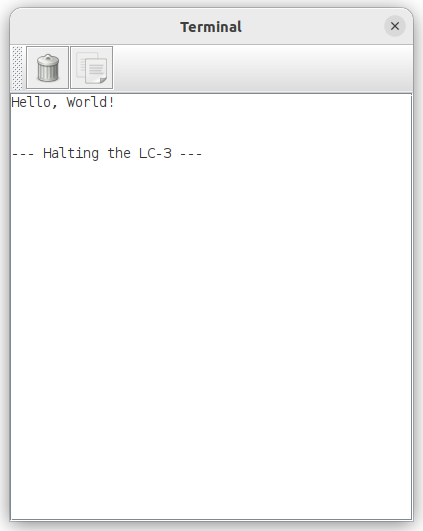

# LC3-Simulator

## Introduction

This repo facilitates simulating the LC-3 processor in Designer for student of CS 061 at UC Riverside. This simulator shows the 
entire datapath and allows students to observe how processors execute instructions at a very fine grained level. 

The LC-3 processor was created as a teaching tool for the book ["Introduction to Computers Systems: From bits and gates to C++ & 
beyond"](https://www.mheducation.com/highered/product/introduction-computing-systems-bits-gates-c-c-beyond-patt-patel/M9781260150537.html) 
by Yale N. Patt and Sanjay J. Patel. The goal of this book is to teach beginning students how to program by teaching them first 
how a computer works, then teaching them assembly programming and finally introducing a high level compiled language, C++. This 
book is meant to be taught over two semesters, or three quarters. 

At UC Riverside, however, this book is used to teach CS 061 - Machine Organization & Assembly Language Programming. This course 
one quarter course is required for all computer science, computer engineering, and electrical engineering students. Unlike the 
original intention of the book's authors, this course is taught after the students have taken the introductory programming courses that use C++.

Towards the end of the quarter, this course concentrates on the datapath to teach students how an instruction is executed in a 
modern processor. In the past, instructors used the figures from the book and drew on them to illustrate this datapath. Later,
animated slides were created to better and more accurately summarize all the steps and control signals necessary to execute 
instructions. These slides are were a big improvement, but some students were still left wanting a better and deeper understanding
of everything that happens in the datapath. This desire let the instructors to create the LC-3 processor in schematic capture
in [Digital](https://github.com/hneemann/Digital), a free and open source digital logic designer and circuit simulator by Helmut
Neemann.

Appendix C of the book provides a complete description of the microarchitecture of the LC-3 processor, upon which this simulation
is designed. Everything except interrupt driven IO works in this simulator with only a few variations from the provided 
microarchitecture.

The rest of this page describes how to get all the tools necessary to run this simulation. It also provides basic instructions for
running the simulator and getting examples as well as custom programs, written in LC-3 Assembly, running in it.

## Getting the simulator

The LC-3 Microarchitecture Simulator is an aggregation of three components, the Digital program, a GitHub repo with the LC-3 
architecture module files for Digital, and an open source HDL synthesizer, [Icarus Verilog](https://github.com/steveicarus/iverilog). 
You must install all three of these components to run the simulator on your local machine. Addtionally, instructions are provided 
below to run the simulator in a Codespace using this GitHub repository.

### Running Digital in a GitHub Codespace

This GitHub repository has all the configuration necessary to run as a [Codespace](https://github.com/features/codespaces) on
GitHub. Any free GitHub user can start a codespace and run this simulation entirely in a browser. Free GitHub accounts come with
upto 120 hours of free Codespace usage per month.

To start the codespace, on this GitHub page click on Code -> Codespaces -> "Create Codespace on main". This action will start the
set up of the codespace. This process can take anywhere from 5 to 10 minutes.

Once it is complete, you will be in Visual Studio Code in your browser. To run Digital, you will need to open a VNC tab. At bottom
of the Visual Studio Code window you may see several tabs including Problems, Output, Terminal, and Ports. If you do not see these
tabs go to View -> New Terminal, and you should see the tabs. Click on the Ports tab. Find the port 6080 and hover over it in the 
column "Local Address". You should then see a globe icon. Click on this icon, which will launch a new tab in your browser. This opens the NoVNC
tab, press the "Connect" button and you are then asked for a password. The password is "cs061". Enter this password and press "Send credentials". 
You should now see a windows session that looks like the following: 

At the lower left of this window you will see an arrow and the time. If you don't see it, scroll down until you do. Click on the arro
and select Digital. This will open the logic design program, Digital. In this program, click File -> Open. In the file dialog box
navigate to th directory /LC3_realized and select lc3.dig and then press "Open". You are now in the LC3 simulator. See the section
below called "Running the Simulator"

### Installing Digital on your local computer

Running the simulator in a Codespace is not optimal. The othe option is to run Digital on your local computer. To do this, you will 
need to install three pieces of software, the Java Runtime Enivornment (JRE), icarus-verilog, and Digital itself. The following 
describes either how to install these programs, or where to find instructions for installing each of these pieces of software.

#### Digital

Digital can be downloaded directly from GitHub [here](https://github.com/hneemann/Digital/releases/latest/download/Digital.zip). This
file is the same whether you are on Windows, Mac OS X, or Linux. Unzip the file somewhere in your home directory.

Running the Digital app requires double clicking on the file Digital.jar in the directory that you unzipped above.

#### Java Runtime Environment

If you double clicked Digital.jar and you received an error, it is most likely because you do not have the Java Runtime Environment
installed on you computer. To download the JRE, click on [this link](https://openjdk.org/install/) and follow the directions for your 
system. The minimum required version of the JRE is Java 8, but any new version will work as well, such as Java 11.

#### Icarus Verilog

Finally, one of the components of the LC3 simulator requires synthesis using the hardware definition language verilog. Luckily, there
is an open source solution called Icarus Verilog.

The instructions are differnt for each of the operating systems Windows, Mac OS X and Linux. Below are links to instructions for each
of thes systems.

1. [Windows](https://bleyer.org/icarus/)
2. [Mac OS X](https://ports.macports.org/port/iverilog/)
3. [Linux](https://iverilog.fandom.com/wiki/Installation_Guide)

#### Downloading the LC3 Simulator files for Digital

One last thing you need to do, is download the .dig files for the LC3 Simulator. These files are available through GitHub. You can 
clone the respository at the URL [https://github.com/ucrdrk/LC3_realized](https://github.com/ucrdrk/LC3_realized).

## Running the Simulator

Now that you have Digital installed and all the supporting software, you can now run the simulator.

First open Digital. If everything is working, simply navigate to Digital.jar and double click it. Next, you will open the LC3 simulator.
In Digital, click File -> Open and then navigate to where you cloned LC3_Realized. In that directory, select lc3.dig. You should see 
something like the following:

To run the program, first click the run button at the top of Digital, and then the fast-forward play button, which is right next to
the play button. This starts the clock running on its own until the program is done. The default program is "Hello, World". When it's 
finished running you should see the following:

### Running other examples

There are 4 other programs you can run, Programming Assignment 1 (assn1), Programming Assignment 2 (assn2), Programming Assignment 3 (assn3),
Programming Assignment 4 (assn4), and Programming Assignment 5 (assn5). To load these programs, in Digital, click on Edit -> Circuit
Specific Settings and click on the Advanced Tab. Under "Program File" on the Advanced tab, click on the button with 3 dots next to the file
name. Now in the same directory as the LC3_Realized repository pick on of assn1.hex, assn2.hex, assn3.hex, assn4.hex or assn5.hex. Next
click on the Play button as before and run the program.

### Stepping through the Instruction Cycle

Sometimes it is more interesting to control the clock manually and see all the phases of the execution cycle. To do this start by clicking the 
play button as before, but before you click the fast-forward play, make sure the Enabled input is set to one. This input is just below Breakpoint
in the Debug/Controls box. Once it's set to one, now you can press the fast-forward play. This will then break at address x3000 and you
can manually control the clock by clicking on the Clk module, also in the Debug/Controls box. You can continue running at any time by clicking
the fast-forward play button again.

### Getting your own LC-3 assembly running

Directions for running other programs besides those provided is coming soon.